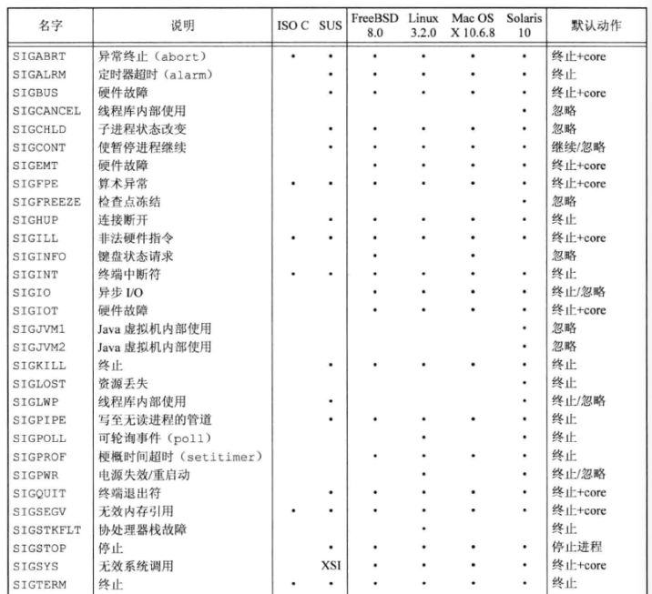
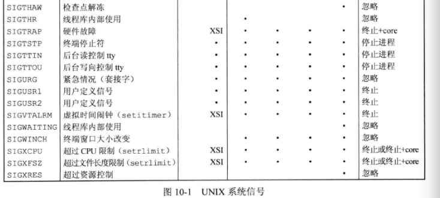
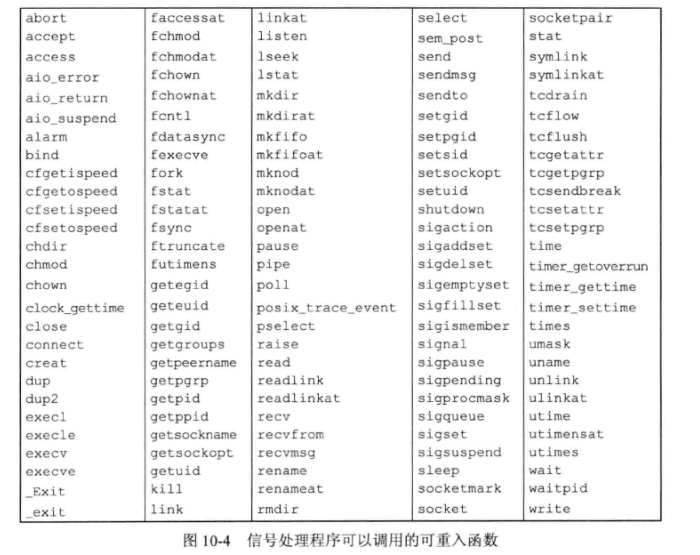

[TOC]

# 信号

## 概述

很多条件都可以产生信号，所有信号都以SIG开头，在signal.h中信号被定义为正整数常量(信号编号)。不存在编号为0的信号。

很多条件都可以产生信号：

- 在终端按`Ctrl+C`，可以产生终端信号SIGINT。这事停止失去控制程序的办法。
- 硬件产生异常信号。如除数为0或者无效内存引用。硬件通知内核，内核为正在运行的进程产生适当的信号。
- 进程调用kill函数
- 用户调用kill命令
- 某种软件条件发生

信号是异步产生的。信号的到来对于进程来说是不确定的，所以进程不能简单的测试一个变量确定是否来了信号，而是必须告诉内核，在此信号发生后执行以下操作。一般有三种方式进行处理，我们称之为信号处理：

1. 忽略信号。两种信号不能被忽略，就是`SIGKILL`和`SIGSTOP`。是为了保证内核或者超级用户去停止进程的权利。如果顾虑硬件异常信号，进程的运行行为是未定义的
2. 捕捉信号。通知内核，在某个信号发生时，调用某个用户函数，类似与中断处理函数。注意不能捕捉`SIGKILL`和`SIGSTOP`
3. 执行系统默认的动作。大多数信号的默认动作都是终止进程





具体信号说明见252页

## 函数signal

```c
//signal.h
void (*signal(int signo, void (*func)(int))) (int);
//成功返回以前的信号处理配置，出错返回SIG_ERR
```

- signo是信号名
- func的值是常量SIG_IGN、常量SIG_DEL或接收到此信号后要调用的函数的地址。
  - SIGDEL表示系统默认动作
  - SIG_IGN表示忽略信号

signal返回一个函数指针，该指针指向的函数无返回值(void)。该函数有一个整形参数，既后面的int

用typedef可以简化：

```c
typedef void Sigfunc(int);
Sigfunc *signal(int, Sigfunc *);
```

## 可重入函数

如果进程捕捉到信号并调用处理函数，正在执行的指令序列就会被替换为信号处理总的指令。处理返回后，继续执行调用前的指令序列。

这会产生一些问题，比如调用信号处理前正在执行malloc申请堆中的内存，此时插入执行信号处理程序，在信号处理时又调用malloc。可能对进程造成破坏，因为malloc通常为所分配的存储区维护一个链表，而执行信号处理函数时，原进程可能正在修改该链表。

又如，在调用处理函数时执行getpwnam，这个函数会将结果存放在静态存储空间，在执行处理函数时又调用了getpwnam，那么结果会覆盖掉原来的。

但是有些函数不会受影响，这些函数是`可重入函数`（意思是可以重新回来不会产生错误），并被称为`异步信号安全(async-signal safe)。除了可重入，在信号处理操作期间，会阻塞任何会引起不一致的信号发送。



注意：标准IO函数很多实现都以不可重入的方式使用全局数据结构。

