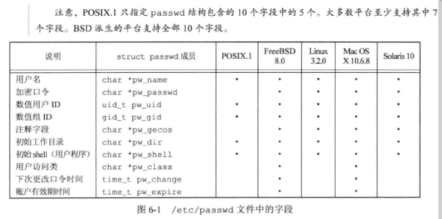
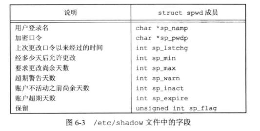
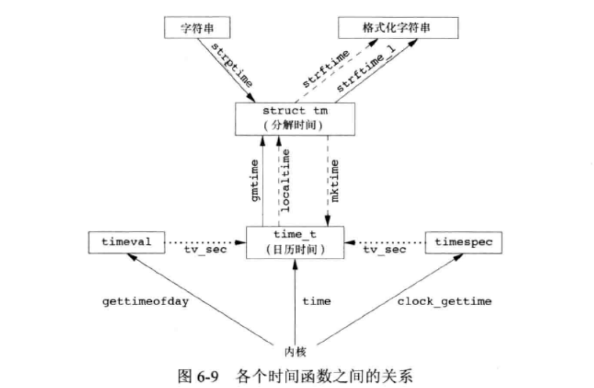
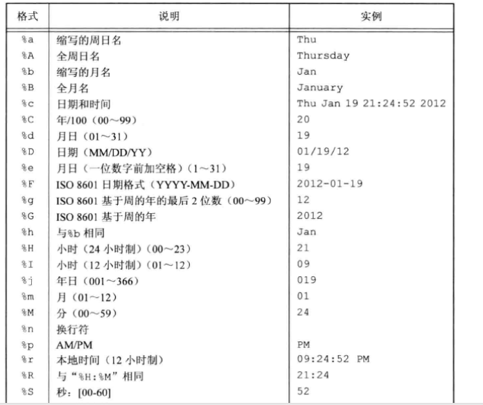
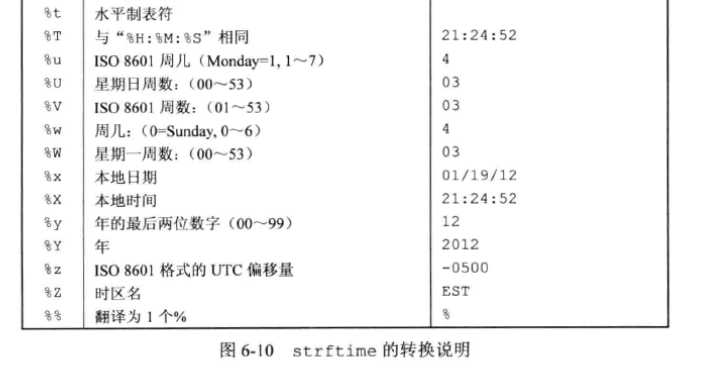
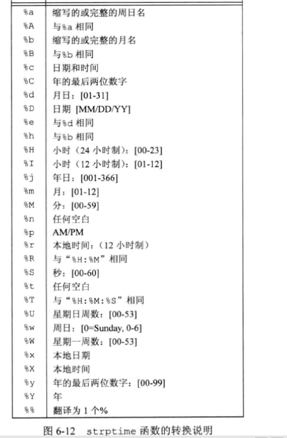

[TOC]

# 系统数据文件和信息

## 口令文件



例如，/etc/passwd文件

```
root:x:0:0:root:/root:/bin/bash
```

- root 通常ID都是0
- 加密口令占用一位。早期版本该字段存放口令，现在口令转移到别的文件。
- 如果口令字段为空，该用户无口令。
- shell字段是可执行程序，指定用户登录的shell。如果为空使用系统默认

- nobody是任何人都能登陆，但是不提供任何特权，这能访问人人都可读写的文件。

## 获取口令文件 getwpuid getpwnam

```c
//pwd.h
struct passwd * getpwuid(uid_t uid);
struct passwd * getpwnam(const char *name);
//成功返回指针，失败放回NULL


struct passwd *getpwent(void); //搜索整个口令文件
//成功返回指针，出错或到文件尾返回NULL
void setpwent(void); //自我保护措施，确保在调用在文件头
void endpwent(void); //getpwnam和getpwuid完成后要调用endpwent关闭文件

//搜索整个文件demo
struct passwd *p;
setpwent(); //确保定位开始处
while((p=getpwent())!=NULL){
    if(strcmp(name, ptr->pw_name) == 0)  //name自己替换
        break; //找到对应的
}
endpwent(); // 关闭文件
```

eg:

```c
#include <pwd.h>
int main(int argc, char *argv[]) {
	struct passwd * passwd;
	passwd=getpwnam(argv[1]);
	printf("name: %s \n", passwd->pw_name);
	printf("passwd: %s",passwd->pw_passwd);
}
```

## 阴影口令

加密口令是单向加密算法处理的用户口令副本。



阴影口令文件不是一般用户可以读取的。但是passwd可以用户自由读取

```c
//shadow.h
struct spwd *getspnam(const char *name);
struct spwd *getspent(void);
//失败返回NULL

void setspent(void); 
void endspent(void); //关闭文件
```

## 组文件

头文件： grp.h

struct group :  


```c
//grp.h
struct group *getgrgid(gid_t gid);
struct group *getgrnam(const char *name);
//成功返回指针，失败返回NULL
```

如果搜索整个文件组：

```c
//grp.h
struct group *getgrent(void);
//成功返回指针，出错或到文件尾端返回NULL
void setgrent(void);
void endgrent(void);
```

## 附属组ID

从前（大概是1983一起），一个用户只能属于一个组。后来引入了附属组ID（supplementary group ID），从此，用户不仅属于口令文件记录项中的ID组，还最多可以属于16个额外的组。所以文件访问检查权限时不仅与进程的有效组ID比较，也要与附属组ID比较。


### 查看附属组ID

```c
//include <unistd.h>
int getgroups(int gidsetsize, gid_t grouplist[]);
//成功返回附属组ID数量，出错返回-1
//include <grp.h> Linux
//unistd.h  on FreeBSD,Mac Os X and Solaris
int setgroups(int ngroups, const gid_t grouplist[]);

//<grp.h> Linux an Solaris
//unistd.h FreeBSD and Mac OS X
int initgroups(const char *username, git_t basegid);
//0  -1
```

- getgroups将进程所属的用户的各个附属组ID填写到数组 gouplist中。 最多为gitsetsize个。

- setgroups 超级用户调用易变为调用进程设置附属组ID表。grouplist是ID数组。ngroups说明了数组中的元素数量。不能大于NGROOUPS_MAX
- initgroup用username确定组的成员关系，然后它调用setgroups，从而为该用户设置ID表。要有超级用户权限。 basegid是username在口令文件中的组ID


## 其他文件


几乎对于每个文件都有：

- get函数  读取下一个记录。（个人理解是当前文件的offset的下一个记录，遍历条目比较取符合条件的常用这个。配合set和end）

- set函数 打开相应的数据文件，如果没有打开就反绕该文件。如果希望在文件起始出处理，就调用这
- end函数 关闭数据文件。

大多数还提供了某种搜索的函数如getpwnam等，如上图


## 登录账户记录：

utmp文件记录


登录是login填写这个数据结构。然后写入utmp和wtmp中。注销时init进程清除utmp。 wtmp是登录记录，使用last命令访问。who命令读取当前登录账户信息。

> 文件路径： 
>
> Linux3.2和FreeBSD 8.0 ：/var/run/utmp 和 /var/log/wtmp
>
> MacOS X 10.6.8 不存在
>
> Solaris /uar/adm中

## 系统标识 uname  gethostname

```c
//sys/utsname.h
int uname(struct utsname *name);
//非负   -1

```


```c
//unistd.h
int gethostname(char *name, int namelen); //返回主机名。
```


## 时间和日期

UNIX内核基本事件符文是UTC(Corrdinated Universal Time 自协调世界时)，计算方法是：公元1970年1月1日00:00:00以来的秒数。数据类型是time_t，成为日历时间。

### 返回当前时间time

```c
//time.h
time_t time(time_t *calptr);
//失败-1
```

如果参数非空，时间值也存到*calptr中;

### 获取制定时钟时间clock_gettime

POSX1.1实时扩展增加了对多个系统时钟的支持。


```c
//sys/time.h
int clock_gettime(clockid_t clock_id, struct timespec *tsp));
//0 -1

// 把上边得到的tsp结构结构化成clock_id 对应的精度。
int clock_getres(clockid_t clock_id, struct timespec *tsp);
//0 -1
```

- clock_id  
  - CLOCK_REALTIME  clock_gettime和time类似。系统支持高精度时间值的话可能比time函数精度更高。
- tsp 接收结果


### 设定时间 clock_settime

```c
//sys/time.h
int clock_settime(clock_id clock_id, const struct timespec *tsp);
// 0 -1
```

需要特权更改，有些时钟不能更改。


### 时间转换：




tm结构：


涉及到的函数：

```c
//time.h
struct tm *getime(const time_t *calptr); //协调统一的时间（UTC）的年月日等
struct tm *localtime(const time_t *calptr); //考虑本地时区和夏令时标志
//出错返回NULL

time_t mktime(struct tm *tmptr);
//出错NULL

```

strftime类似printf，可以制定产生的字符串。


- buf 最终得到的结果
- maxsize buf数组长度
- format 类似printf





- tmptr 要格式化的时间值

例如：

```c
strftime(buf2, 64, "time and data: %r, %a %b %d, %Y",tmp);
printf("%s\n",buf2);
```


```c
//time.h
char *strptime(const char *restrict buf, const char *restrictformat , struct tm *restrict tmptr);
//成功指向下一个字符指针，否则NULL
```




### TZ影响的函数localtime mktime strftime

