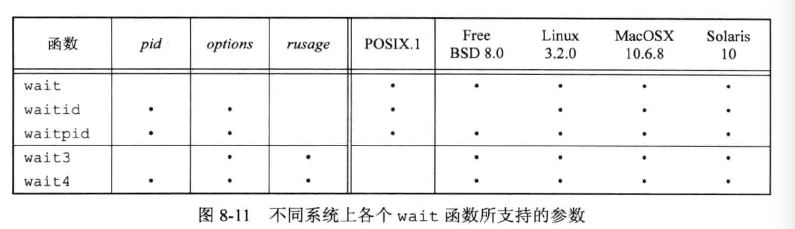
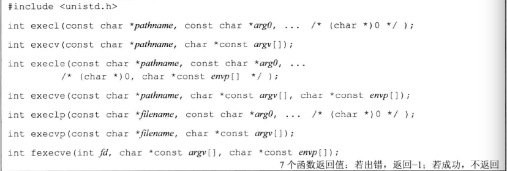

[TOC]

# 进程控制

## 进程标识——进程ID

- 每个进程都有唯一的进程ID，是非负整型，用来标识该进程。

- 进程ID可复用。进程结束后，该ID会分配给其他新的进程。大多数会延迟复用，防止出现错误

- ID为0的是调度进程，也成为交换进程(swapper)。是内核的一部分，不执行任何磁盘上的程序，也是系统进程。

- ID为1是`init进程`。`自举`过程结束后由内核调用。进程文件位于`/etc/init(早期)`，`/sbin/init(较新版本)`。负责在自举内核后启动一个unix系统。通常读取初始化文件(/etc/rc*、/etc/inittab、/etc/init.d中的文件)，引导系统进入一个状态，例如多用户。init不会终止，他是一个用户普通进程。与swapper不同。但是他是root特权下运行的。

  > Mac OS X 10.4 init进程被launchd进程代替。扩展了功能。

- ID 2 是`页守护进程` ，负责支持虚拟存储器系统的分页操作。

获取标识符：

```c
//unistd.h
pid_t getpid(void);
//返回进程ID

pid_t getppid(void);
//调用进程的父进程ID

uid_t getuid(void);
//实际用户ID

uid_t geteuid(void);
//有效用户ID

gid_t getgid(void);
//实际组ID

get_t getegid(void);
//有效阻ID

//都没有出错返回
```


## fork 创建新进程

```c
//unistd.h
pid_t fork(void);
//子进程返回0，父进程返回子进程ID；出错返回-1
```

fork被调用一次，但是返回两次。

子进程的ID返回给父进程的理由：

- 一个进程可以有多个子进程，并且没有函数能一下子获得自己所有子进程的ID。

子进程返回0的理由：

- 一个进程只能够有一个父进程。子进程随时都可以通过getppid获得父进程的ID。


注意：执行fork后，子进程是父进程的副本，获得父进程的数据空间、堆栈的**副本**。他们并不共享这些存储空间部分。**只共享正文段。** 先执行哪个不确定，取决于内核调度。

fork后如果跟随exec，那么子进程并不执行一个父进程数据段、栈、堆的完全副本。使用写时复制（Copy-On-Write）技术。这些区域父进程和子进程共享，并且内核把他们权限设置为只读。任何一个想要修改这些区域，就修改区域的那块内存做副本。

> Linux 3.2提供了clone系统调用，fork的推广，允许操作那部分由父进程和子进程共享。
>
> FreeBSD 8.0提供了rfork

### example:


注意的点：

- write里面的字符串长度：sizeof计算包括字符串终止符null。避免将null字符输出，所以要减1。 strlen计算不包括null，如果用它就不用减1。他们的区别在于sizeof在编译时就计算长度，而strlen要函数调用。

- 输出到文件和输出到终端，printf打印次数不一样：

  ​	因为标准IO库带缓冲，输出到终端时是行缓冲的，所以遇到换行符，就冲洗缓冲区。printf只输出一次。输出到文件是全缓冲的，fork之前调用了一次printf，结果存放在缓冲区并没有冲洗，调用fork后，缓冲区也被复制到了子进程中，直到exit才冲洗，所以`before fork`被打印两次。


文件共享问题：

在重定向父进程的标准输出时，子进程的标准输出也被重定向。因为fork后复制的是文件描述符，但是他们指向的仍然是同一个文件表项。文件表项由内核维护

例如：


- 父进程子进程共享一个文件偏移量。

- 如果写同一个描述指向的文件没有任何同步，他们的输出就会相互混合。


### 其他继承项目

- 实际用户、实际组、有效用户、有效组的ID

- 附属组ID

- 进程组ID
- 回话ID
- 控制终端
- 设置用户ID标志和设置组ID标志
- 当前工作目录
- 根目录
- 文件模式创建屏蔽字
- 信号屏蔽和安排
- close-on-exec标志
- 环境
- 链接的共享存储段
- 存储影响
- 资源限制

区别：

- fork返回值不同
- 进程ID不同
- 父ID不同
- 子进程tms_utme/tms_stime/tms_cutime/tms_ustime设置为0
- 不继承父进程文件锁
- 子进程的未处理闹钟被清除
- 未处理信号设置为空

### fork失败原因

- 系统中现有进程太多
- 实际用户ID进程数超过限制

### fork常见用法

- 父进程赋值自己，父进程子进程同时执行不同代码
- 一个进程要执行另外一个程序，子进程返回后调用exec

## wait和waitpid

### 父子进程结束通讯

进程正常或者异常终止，内核就向它的父进程发送SIGCHLD信号。子进程终止是异步事件，所以内核发送的是异步通知。父进程可以忽略信号，或者提供一个调用函数。默认忽略

### 调用wait waitpid发生什么：

- 所有子进程都在运行，则阻塞
- 如果有一个子进程终止，父进程获取终止状态，取得后立即返回
- 没有子进程就返回报错

### 原型

```c
//sys/wait.h
pid_t wait(int *status);
pid_t waitpid(pid_t pid, int *statloc, int options);
//success：renturn ID，error，0 or -1
```

区别：

- 子进程终止前，调用wait父进程会阻塞，waitpid有可选项options不阻塞
- waitpid并不是等待第一个返回的子进程，可以控制所有等待的进程。

如果子进程已经终止，并且是僵死进程，wait立即返回并取得子进程状态。

statloc是一个整形指针，终止状态存放在这里。可以设置为空指针，不获取状态。

pid： 

- ==-1 任何一个进程，此时waitpid和wait等效
- pid>0 等待进程ID与pid相等的子进程
- ==0 等待组ID等于调用进程组的任意子进程
- <-1 等待组ID等于pid绝对值的任意子进程。

options：0或者下面按位与的结果


## wait3和wait4

```c
//sys/types.h sys/wait.h  sys/time.h  sys/resource.h
pid_t wait3(int *statloc, int options, struct rusage *rusage);
pid_t wait(pid_t pid, int *statloc, int options, struct rusage *rusage);
//成功返回ID，出错-1

```

允许内核返回 由终止进程及其子进程使用资源的情况。

statloc是终止状态。




## exec程序调用

exec不会改变进程ID，只是用新程序替换了当前进程的正文段、数据段、堆、栈段



- filename里包含/，就视为路径名。否则按照path环境变量搜索可执行文件。如果该文件不是编译器产生的可执行文件，就认为他是shell脚本，尝试使用/bin/sh + filename 作为shell的输入。
- 参数表传递：函数名 l表示list，v表示vector。 
  - execl、execlp、execle要求将新程序的每个命令参数都说明为一个单独的参数。这种参数表以空指针结尾。
  - execv、execvp、execve和fexecve 是应县构造一个指向各个参数的指针数组，然后将该指针数组作为4哥函数的参数。
- 以e结尾的函数execle，execve和fexecve可以传递一个指向环境字符串的数组指针。其他的是调用进程中environ变量赋值现有的环境。如果系统支持setenv和putenv这样的函数，可以更改子进程不影响父进程的状态。

在ISO C原型中，所有命令行参数、空指针和envp指针都用省略号...表示。


### 调用exec后新程序从父进程中保留的属性

- 各种ID
- 控制终端
- 闹钟尚余留的时间
- 当前工作目录
- 根目录
- 文件模式创建屏蔽字
- 文件锁
- 进程信号屏蔽
- 未处理信号
- 资源限制
- nice值
- tms_utime tms_stime tms_cutime tms_cstime

对打开文件的处理：

​	这与文件描述符的执行时关闭标志值有关。FD_CLOEXEC，进程中每个打开描述符都有一个执行时关闭表示。如果设置了该表示，执行exec时关闭该描述符，否则仍然打开。系统默认是exec后仍然保持打开，可以使用fcntl设置。


### 例程：


## 更改用户ID和更改组ID

两个重要概念：

`特权`：比如能否改变当前日期的表示方法

`访问控制`：能否读写一个特定文件

他们的控制都是基于用户ID和用户组ID的。在设计应用时，要试图使用最小特权模型。

## 使用setuid和setgid设置实际用户ID和有效组ID

```c
int setuid(uid_t uid);
int setgid(gid_t gid);
//0  -1
```

- root用户可以随便设
- 要设置的uid等于实际用户ID，setuid只将有效用户ID设置为uid

- 否则设置为errno为EPERM，返回-1


其他注意事项

- 只有root能够更改实际用户ID。
- 仅当程序文件设置了用户ID位，函数才设置有效用户ID，否则exec函数不会改变有效用户ID。任何时候都可以调用setuid。
- 


### 组ID

略。后补2019.9.20


## 解释器文件

文本文件起始行：

```bash
#！ pathname[optional-argument]
例如：
#! /bin/sh    
```

#!后面的空格是可选的。

这种文件的识别是内核作为exec系统调用的一部分来完成的。内核调用exec函数进程启动第一行指定的程序，来解释该文件。

**要写全局路径，因为不对第一行进行PATH搜索**


## system函数，执行命令行

```c
//stdlib.h
int system(const char *cmdstring);
```

system在其实现中调用了fork exec waitpid，所以他有3种返回值

- fork失败或者waitpid返回除了EINTR之外的错误，system返回-1，设置errno指示错误类型
- exec失败，代表shell不能执行，其返回值如同shell执行exit(127)一样。
- 都成功，返回shell终止状态。


使用system而不是使用fork和exec有点：

​	system进行了各种出错处理和信号处理。


## 进程会计

不同系统进程会计实现略有不同，没有标准的协议规定。这里略过，有需要再补充

进程会计（progress accounting）是进程结束后内核写一个会议记录。包括cpu时间总量，用户ID和组ID，启动时间等。


## 用户标识

任何进程都可以得到到实际用户ID和有效用户ID和组ID。如果希望找到运行该用户的登录名，我们可以调用getpwuid(getuid())。

但是系统允许一个用户有多个登录名，以对应不同的shell，不用用户名共用同一个用户ID。这时候可以使用，getlogin函数获取登录名

```c
//unistd.h
char *getlogin(void);
//成功返回字符串指针，出错NULL
```

获取登录时的用户名后，就可以用getpwnam获取口令文件中相应的用户记录，确定用户其他信息，如登录使用的shell


## 进程调度

unix系统对进程调度是通过优先级。调度策略和调度优先由内核确定。可以通过调整nice值来调整优先级。**只有特权进程**允许提高调度权限。

nice值越高，越友好，占用cpu时间越短。

nice值越低，越紧急，占用cpu时间越多。

nice值的范围 0~(2*NZERO)-1 ，有些是0~(2*NZERO)


**linux可以通过sysconf(_SC_NZERO)获取nzero的值**，通过一下例子可以让程序更健壮。

```c
#if defined(NZERO)
	nzero=NZERO;
#elif defined(_SC_NZERO)
	nzero=sysconf(_SC_NZERO);
#else
#error NZERO undefined
#endif
```


### 更新修改nice值， nice

```c
//unistd.h
int nice(int incr);
//成功返回新的nice值，出错返回-1，同时errno不为0
```

- incr被加到nice值上。 如果太大系统会降低到最大合法值，不给出提示。最小同理。

注意：-1可能是合法的返回值，所以每次调用的nice之前要清除errno，如果nice返回-1需要检查errno的值


### 获取进程的nice值 getpriority

```c
//sys/resource.h
int getpriority(int which, id_t who);
//成功返回-NZERO~NZERO-1之间的nice值，出错-1
```

- which取值如下，控制如何解释who参数
  - ​	PRIO_PROCESS 表示进程
  - PRIO_PGRP表示进程组
  - PRIO_USER表示用户ID

- who选择一个或多个进程，如果为0，表示调用进程、进程组、或者用户。


### setpriority 为进程、进程组、特定用户ID的所有进程设置优先级

```c
//sys/resource.h
int setpriority(int which, id_t who, int value);
//0 -1
```

value增加到NZERO，编程新的nice值


一般，子进程从父进程中集成nice值（FreeBSD 8.0 Linux3.2 MacOs X Solaris 10）