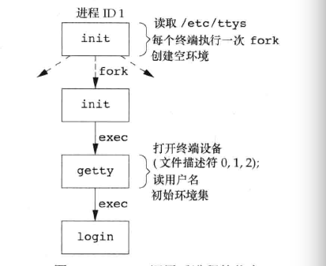
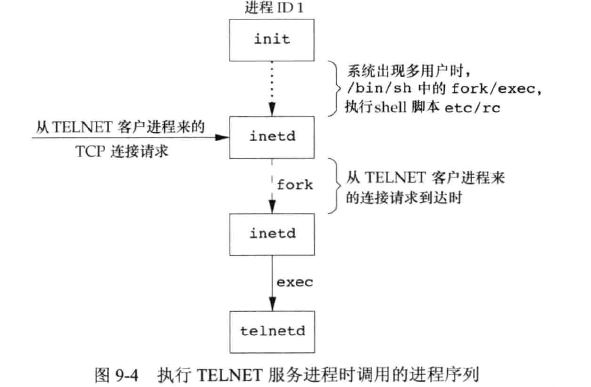
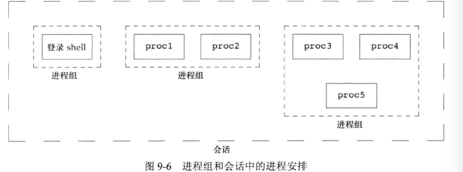
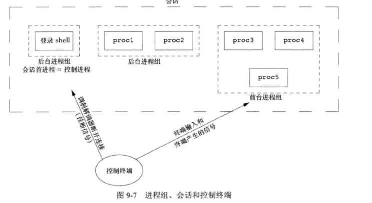
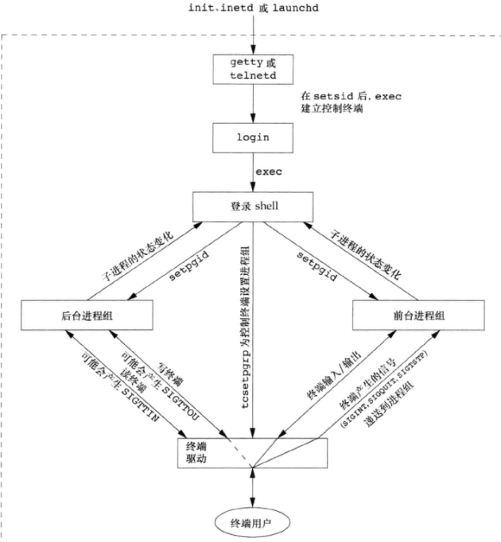

# 进程关系

[TOC]

## 终端登录

### 终端登录原理

启动过程：

1. 内核创建init进程(ID=1)
2. init读取/etc/ttys，对于每个允许登录的终端设备，调用一次fork
3. 子进程exec getty程序
4. getty程序对终端设备调用open函数，以读写方式将终端打开。一旦终端被打开，文件描述符012就会设置到该设备。
5. getty输出“login”之类的信息，等待用户键入用户名
6. 用户键入用户名后，getty的工作完成，调用login程序。输入密码是login程序处理的



现代操作系统支持多个身份验证登录，基本都支持PAM(Pluggable Authentication Modules，可出入的身份验证模块)的方案。允许管理人员配置使用何种身份验证方法来访问那些基于PAM库编写的服务。

服务程序验证用户是否具有适当的权限执行某个服务，两种方案：

- 将身份验证机制编写到应用程序中
- 使用PAM库

如果用户正确登录，login完成的工作：

- 设置工作目录为用户起始目录
- 调用chown更改总段的所有权，使登录用户为所有者
- 对终端设备的访问权限改为“用户读和写”
- 调用setgid和initgroups设置进程的组ID
- 初始化环境
- 更改登录用户ID并调用该用户的shell。
- 等等略，如打印日期消息等

现在登录shell读取启动文件是.profile(Bourne shell和Korn shell)。GUN Bourne-again shell是.bash_profile .bash_login或.profile。


## 网络登录

通过串行终端登录设备和网络登录到系统的主要区别是：

​	终端和计算机之间链接不再是点到点的。

在网络登录时，login只是一种可以使用的服务，和FTP等性质相同。

网络登录所有都经过内核的网络接口驱动程序（如以太网驱动程序）。所以不确定有多少这样的登录，所以等待网络连接请求到达，而不是像串行终端设备那样让一个进程等待可能到来的登录。

### 伪终端

为了使用同一个软件同时处理终端登录和网络登录，使用了`为终端`的软件驱动程序。仿真串行终端的运行行为，将终端操作映射为网络操作。

BSD网络登录：



然后：

- telented打开一个为终端设备

- fork两个进程。父进程处理网络连接通信，子进程处理login程序
- 父子进程通过伪终端连接。调用exec之前，子进程文件描述符0/1/2与伪终端相连。

> Linux某些版本使用xinetd代替inetd


## 进程组

每个ID处理有唯一进程ID之外，还属于一个进程组。通常在同一个作业中合起来的。同一进程组各个进程接收统一中断的信号。

### getpgrp 获取进程组ID

```c
//unistd.h
pid_t getpgrp(void);
//调用进程的进程组ID
```


- 每个进程组有一个`组长进程`。`组长进程`的`进程组ID`等于其`进程ID`
- 进程组的组长可以创建一个进程组、创见改组的进程，然后终止。
- 进程组中有一个进程存在，进程组就存在。与组长是否终止无关。
- 进程组的生命周期就是创建到最后一个进程结束或离开。
- 该组最后一个进程可以终止，也可以去别的组

### setpgid 设置组ID

```c
//unistd.h
int setpgid(pid_t pid, pid_t pgid);
//0 -1
```

- 将pid进程的进程组ID设置为pgid
- pid == pgid，则制定为组长

- pid为0，使用当前进程ID
- pgid为0，则pgid=pid

一个进程只能为自己或者子进程设置组ID，但是如果子进程执行exec，则不能更改子进程的进程组ID


大多数作业控制shell中，fork之后调用setpgid，父进程设置子进程的进程组ID，同时子进程自己也要设置一下进程组ID，因为fork后谁先执行无法控制。


## 会话

### 概念

会话(session)是一个或多个集成的集合。可以包含多个进程组



通常是由shell的管道将集成编成一组。例如9-6的图：

```bash
proc1 | proc2 &
proc3 | proc4 | proc5
```


### setsid 建立会话

```c
//unistd.h
pid_t setsid(void);
//成功返回进程组ID，出错返回-1
```

调用这个函数一般有两种情况：

1. 调用函数的进程不是一个进程组的组长，那么这个函数就会创建一个新的对话：
   - 该进程编程回话首进程（session leader)。并且是新回话的唯一进程
   - 该进程成为新的进程组组长，新进程ID是调用进程的进程ID
   - 该进程没有控制终端，如果调用之前有也会被切断
2. 如果已经是一个进程组组长，就会报错。不过，可以使用fork，然后终止父进程，在子进程里面调用setsid。子进程继承了父进程的进程组ID，进程ID确实重新分配的，所有子进程就不是进程组的组长了。


## 关于控制终端

- 一个会话可以有一个`控制终端(controlling terminal)`。通常是终端设备或者伪终端设备(网络登录)

- 和控制终端连接的进程是`控制进程 controlling process`
- 在会话中的进程组又分为前台进程组和后台进程组。如果在终端命令结尾加上`&`就说明将这个进程变成后台进程
- 在终端键入中断键(ctrl +c)，中断信号发送到前台组的所有进程
- 如果终端检接口检测到终端断开，将挂断信号发送至控制进程



保证程序不使用标准输入输出重定向的情况下，程序与控制终端对话的方法是open文件/dev/tty。 这个文件相当于控制终端。如果没有控制终端，则open失败


## tcgettpgrp tcsetpgrp tcgetsid 通知内核哪一个是前台组

```c
//unistd.h
pid_t tcgetpgrp(int fd);
//成功返回前台进程组ID，出错返回-1

int tcsetpgrp(int fd, pid_t pgrpid);
//成功返回0 出错返回-1

//termios.h
pid_t tcgetsid(int fd);
//成功返回会话首进程的进程组ID，出错返回-1
```

tcgetpgrp返回前台进程组的ID，与fd上打开的终端相关联。

tcsetpgrp用来将前台进程组ID设置为pgrpid，需要时同一个会话中的。

大多数应用程序不直接使用，通常由作业控制shell调用。

通过tcgetsid函数，可以获取会话首进程的进程组ID。


## 作业控制：

作业控制允许在一个终端上启动多个作业（进程组），它能够控制哪个作业可以访问该终端以及哪些作业在后台运行。

要求：

- 支持作业控制的shell
- 内核中的终端驱动程序支持作业控制
- 内核必须提供某些作业控制的信号支持


如果我们在终端键入字符，只有前台作业能够接收输入，如果后台作业试图读取，会收到一个SIGTTIN信号，该信号会通常停止此后台作业，并且shell向用户发出情况通知。shell用户可以把这个作业转为前台作业，他就可以读取终端。

例子：

```bash
cat > temp.foo & #放入后台,但是它试图从终端读入
[1] 23232
#键入回车
[1] Stopper #因为它在后台，shell给发送了SIGTTIN信号
fg %1 #转到前台

```

如果后台想要输出到终端，发生什么？

 这个可以禁止也可以允许，使用stty来改变这个选项。

```bash
stty tostop #禁止后台输出到终端。如果输出则shell发送挂起信号，进程阻塞，直到调用到前台继续
```



## shell程序的执行与会话、前台进程组关系。

shell执行程序与会话、进程组概念联系起来。

### ps 命令：

```bash
ps -o pid,ppid,pgid,sid,tpgid,comm
# sid 会话id  pgid：进程组ID tpgid：前台组id  comm：命令
```

## 支持作业的shell

把前台作业放入它自己的进程组。如果前台作业只有一个进程，就为这个进程开辟一个组，并且该进程就是组长。并且是前台组。此时shell是后台组。

如果shell执行的程序是后台（比如结尾加 &），那么前台组是shell。

在管道中执行，比如

```bash
ps -o pid,ppid,pgid,sid,tpgid,comm | cat
```

ps 和cat都在同一个新的进程组中，ps是进程组组长。而且这个进程组是一个前台进程组。

```c
ps -o pid,ppid,pgid,sid,tpgid,comm | cat &
```

ps 和 cat都是同一个后台进程组。前台是shell


## 孤儿进程组(未完)

父进程终止的子进程成为孤儿进程(orphan process)。这种进程由init进程收养。整个进程组也称为孤儿


## 